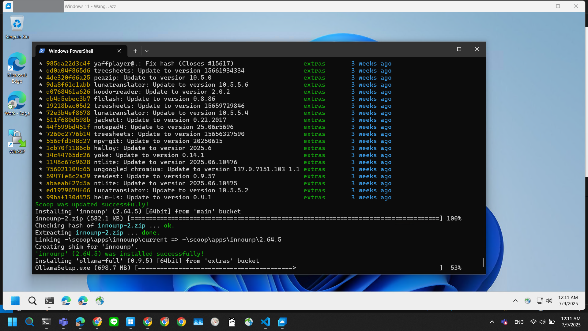
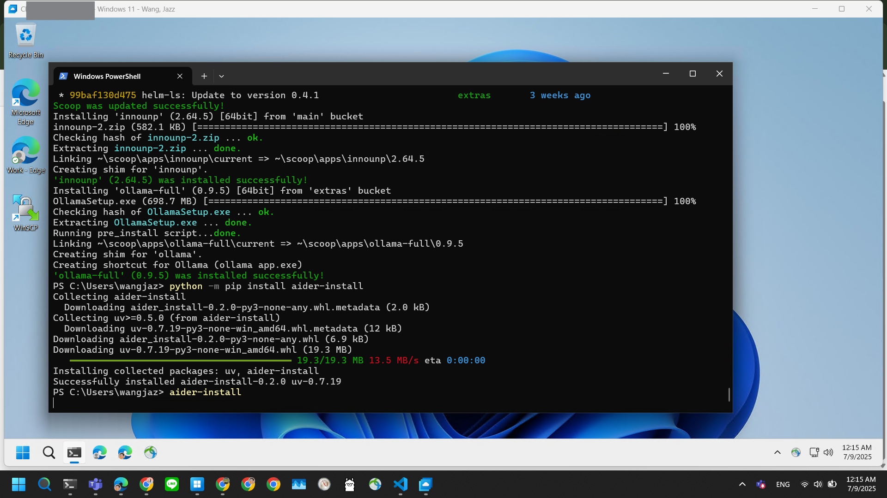
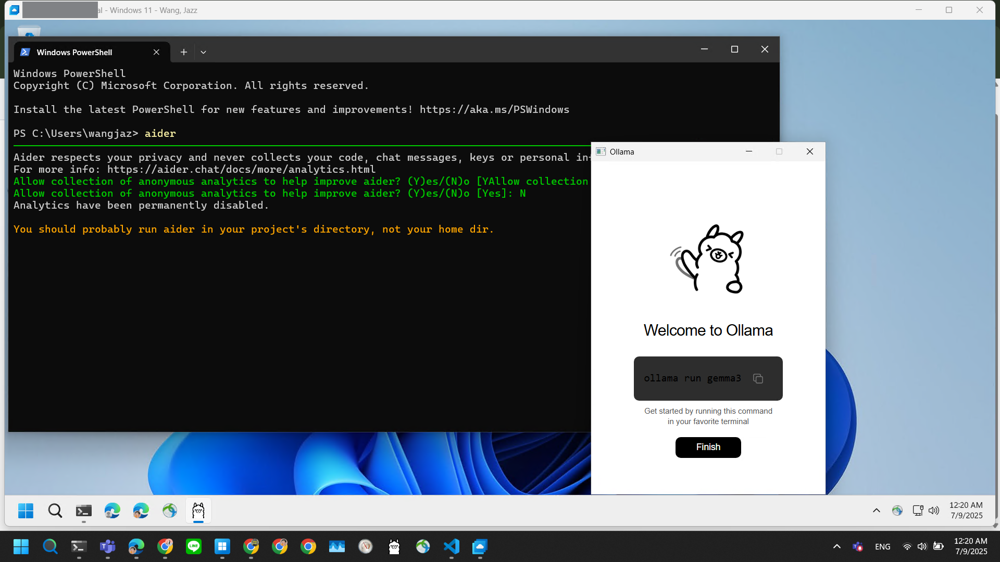
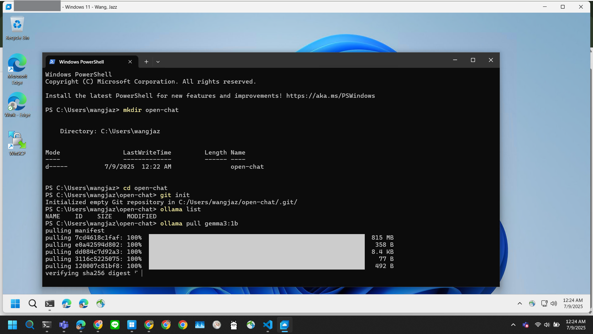
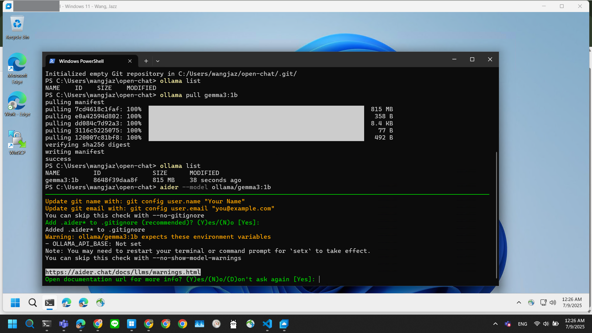

# Running `Aider` and `Ollama` on Windows 11

## Installation

- **Start** > Open `Windows PowerShell`
- Paste the following code:
```powershell
Set-ExecutionPolicy -ExecutionPolicy RemoteSigned -Scope CurrentUser
Invoke-RestMethod -Uri https://get.scoop.sh | Invoke-Expression
scoop update
scoop install git
scoop bucket add extras
scoop install python ollama-full
python -m pip install aider-install
aider-install
setx OLLAMA_API_BASE http://127.0.0.1:11434
```
- close PowerShell
- **Start** > search `ollama`
- run `Ollama` App




## Verify Installation

### Ollama

- Open another new `Windows PowerShell` terminal
- Test with following commands
```powershell
ollama list
ollama pull gemma3:1b
ollama list
```
- If you can see ollama response and download Gemma3 1B model correctly, you're ready to use Ollama




### Aider

- Test with following commands
```powershell
mkdir open-chat
cd open-chat
git init
aider --model ollama/gemma3:1b
```
