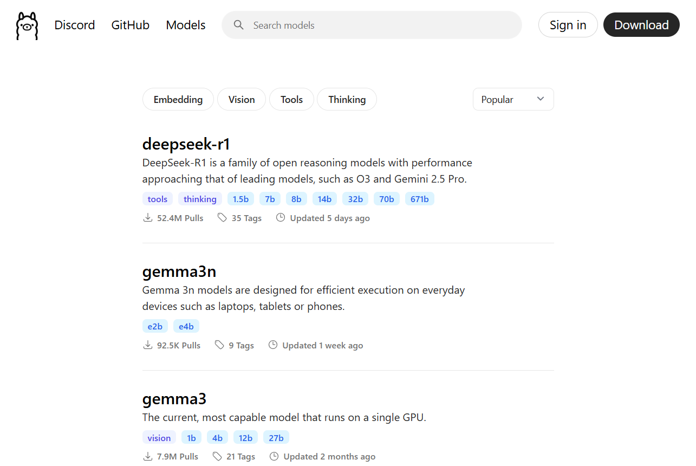
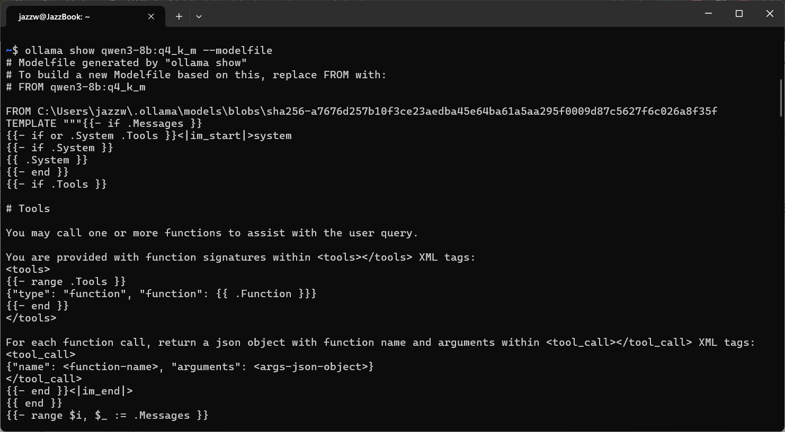
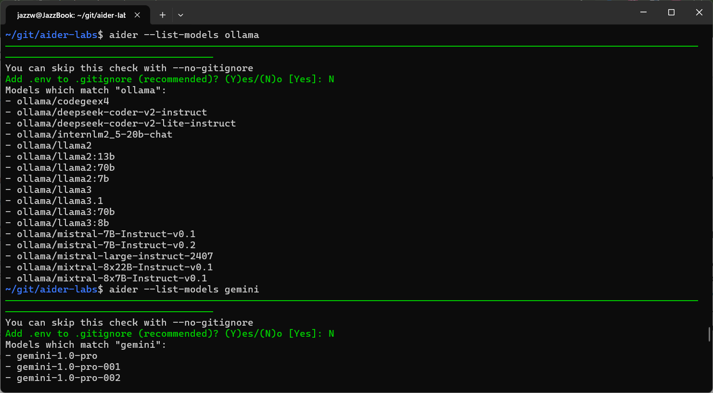
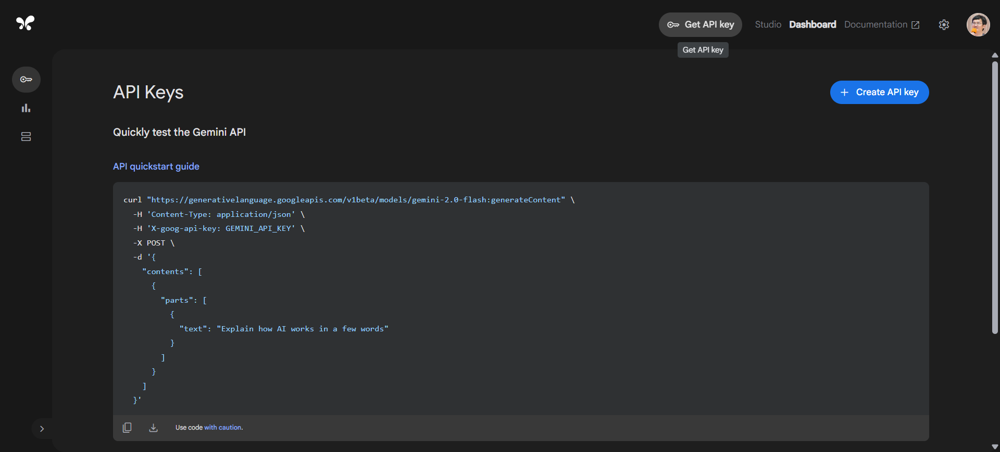

---
presentation:
  theme: night.css
  width: 1920
  height: 1080
  slideNumber: true
  hideAddressBar: true
  history: true
---

<style>
.reveal code { color: #e7ad52; }
.reveal strong, .reveal b { color: #ffccff; }
.reveal em { color: #ccff99; }
quote { color: #e7ad52; }
</style>

<!-- slide -->

## Supercharging Your Daily Workflow <br/> with `Aider` and `Local LLMs`

|||
|---|---|
| <br/><h4>AI Sharing sessions<p/> 2025-07-09 @ Taipei City, Taiwan</h4> <br/>By [Jazz Yao-Tsung Wang](https://jazzwang.github.io/cv/) <br/>Sr. Director of Engineering, TAO Digital<br/>Chairman, Taiwan Data Engineering Association | |

<!-- slide -->

## Agenda

<hr/>

<table><tr>
<td>

- What is Aider?
- What is Ollama?
- Why do we need to use local LLM?
- Install Aider on different platform
  - Google Colab / Cloud Shell
  - Github Codespaces
  - local Windows machine
- Switch between LLM models
  - Local LLM: Ollama
    - Google Gemma 3 1B
  - Public Free LLM
    - Google Gemini 2.5 Flash
- How to request Google Gemini API key?

</td>
<td>

- Known Use Cases that I use Aider:
  - Reverse Engineering
    - create high-level overview
    - create sequence diagram
  - Meeting Summary
    - MS Teams Live Caption (JSON)
    - MS Stream Transcript file (WebVTT)
  - Monthly Team Achievement Summary
    - from Jira JQL export CSV file
  - rewrite program:
    - from Shell Script to Python script
    - migrate from Selenium to Playwright
  - create unit test

</td>
</tr></table>

<!-- slide -->

## What is Aider?
<hr/>

<table><tr>
<td>

- **AI Pair Programming in Your Terminal**:
  Aider allows you to pair program with Large Language Models (LLMs) directly from your terminal.
- **Works with Existing Codebases**:
  Ideal for starting new projects or building upon your current code.
- **Supports Various LLMs**:
  Works best with models like *Claude 3.7 Sonnet*, *DeepSeek R1* & Chat V3, *OpenAI o1, o3-mini & GPT-4o*, and can connect to almost `any LLM`, including `local models`.
- **Codebase Mapping**:
  Creates a map of your entire codebase to work effectively on larger projects.

</td>
<td>

<center>

https://aider.chat/

</center>
<video autoplay="" loop="" muted="" playsinline="" preload="metadata">
  <source src="https://aider.chat/assets/shell-cmds-small.mp4" type="video/mp4">
  Your browser does not support the video tag.
</video>
<center><small>Source: <a href='https://aider.chat/assets/shell-cmds-small.mp4' target='_blank'>https://aider.chat/assets/shell-cmds-small.mp4</a></small></center>
</td>
</tr></table>

<!-- slide vertical=true -->

### Aider Features ( 1 ) - `I tried`
<hr/>

<table><tr>
<td>

<small><a href='https://aider.chat/docs/languages.html'>https://aider.chat/docs/languages.html</a></small>

<small><a href='https://aider.chat/docs/usage/watch.html'>hhttps://aider.chat/docs/usage/watch.html</a></small>


</td>
<td>

- **Extensive Language Support**
  Compatible with over 100 programming languages (Python, JavaScript, Rust, Ruby, Go, C++, PHP, HTML, CSS, etc.).
  - powered by [tree-sitter-language-pack](https://github.com/Goldziher/tree-sitter-language-pack)
- **Git Integration**
  *Automatically commits changes* with sensible messages, allowing easy diffing, management, and undoing of AI changes using standard Git tools.
  - Tip: `aider --no-auto-commits` to disable
  - Tip: `/undo` to *uncommit*
- **IDE Integration**
  Can be used from within your favorite IDE or editor by *adding comments to your code* ended by `AI!` or `AI?`.
  - Tip: `aider --watch-files`
- **Web Chat Compatibility**
  Can streamline copy/pasting code with LLM web chat interfaces, though it works best with LLM APIs.

</td>
</tr></table>

<!-- slide vertical=true -->

### Aider Features ( 2 ) - `I dit not yet try`
<hr/>

<table><tr>
<td>

- **Multimedia Context**
  Supports adding images and web pages to the chat for visual context, screenshots, and reference documentation.
  - (optional) need `playwright` to fetch web pages
- **Voice-to-Code**
  Enables speaking with Aider to request features, test cases, or bug fixes using your voice.
- **Linting & Testing Integration**
  *Automatically lints and tests code after changes*, and can fix problems detected by linters and test suites.

</td><td>


<center><small>

Source: https://aider.chat/docs/usage/lint-test.html

</small><center>

</td>
</tr></table>

<!-- slide -->

## What is Ollama?

<hr/>

<table><tr>
<td>

- **What is Ollama?**
  - open-source tool to run `Large Language Models (LLMs)` on *local machine*.
  - Simplifies local LLM deployment and management.
  - Powered by [llama.cpp](https://github.com/ggml-org/llama.cpp)
- **Core Benefits**: `Local Execution` & `Control`
  - *Data Privacy* & *Data Ownership*:
    Keeps sensitive data on your machine.
  - *Offline* Capability:
    No internet needed after initial download.
  - *Reduced Latency*:
    Faster interactions without cloud reliance.
  - *Cost-Effective*:
    Avoids recurring cloud fees.

</td><td>

https://ollama.com/models



</td>
</tr></table>

<hr/>

<small> Reference: https://www.hostinger.com/tutorials/what-is-ollama </small>

<!-- slide vertical=true -->

### Ollama: Features & Use Cases

<hr/>

- Key Features
  - **Local AI Model Management**
    Full control to *download*, *update*, *delete*, and track different *versions* of models
  - **Command-Line (CLI) & GUI Options**
    Primarily operates via `CLI` for precise control
    supports third-party GUIs like `Open WebUI` for visual interaction.
  - **Multi-Platform Support**
    Broad compatibility across `macOS`, `Linux`, and `Windows`.
- Practical Use Cases
  - Building private chatbots and AI applications,e.g. *legal*, *healthcare*.
  - Conducting secure, `offline` AI research.
  - Integrating AI into existing systems with data privacy in mind
    - e.g. *ERP*, *CRM* within `LAN`

<!-- slide vertical=true -->

### Ollama: few useful Tips

<hr/>

<table><tr><td>

- I pull *GGUF* format models from `LMStudio Community` on `HuggingFace`
  - `ollama pull hf.co/lmstudio-community/gemma-3-4B-it-qat-GGUF:Q4_0`
- get *context length*, *embedding length*, *parameters*, *quantization*
  - `ollama show {MODEL}`
- observe *System Prompt* and *Response Template* from modelfile
  - `ollama show {MODEL} --modelfile`

</td><td>



</td></tr></table>

<!-- slide -->

### Why do we need to use local LLM?

<hr/>

- **Enhanced `Data Privacy` & `Data Security`**
  Data stays local, reducing third-party exposure.
- **No Reliance on Cloud Services**
  Complete control over infrastructure, greater scalability on local servers.
- **Customization Flexibility**
  Tweak models for specific project requirements and tailored datasets.
- **Offline Access**
  Work without an internet connection.
- **Cost Savings**
  Avoid recurring cloud storage, data transfer, and usage fees.

<!-- slide vertical=true -->

### Guideline: *When* to use local LLM?

<hr/>

<table style='border: 1px solid;'><tr><td style='border: 1px solid;'>Use Local LLM</td><td>

When your prompt (input data) contains:
- **Proprietary Business Information**
  information created by the organization
  e.g. Company's `Source Code`, `Financial`, `Pattern`, etc.
- **Material Nonpublic Information (MNPI)**
  organizational information not released to the public
  e.g. `internal server name`, `password`, `announcement`, `wiki`, etc.
- **Personal Information**
  information that can identify an individual.
  e.g. `email address`, `phone`, `mobile`, `address`, `birth`, etc.

</td></tr>
<tr><td style='border: 1px solid;'>Use Public LLM</td><td>

- translate non-sensitive paragraph
- summarize non-sensitive paragraph
- deep research based on web search results
- brainstorm / plan / generate text with Reasoning LLMs

</td></tr>
</table>

<!-- slide -->

### How to install Aider on different platforms?

<hr/>

Here are `PROs` and `CONs` running `Aider + Ollama` on different environments:

-----

| Environment         | vCPU | RAM | VRAM | Disk | PROs | CONs | Labs |
|---------------------|------|-----|----------|------|------|------|------|
| Google Colab        | 2 | 12 GB | (T4) *15GB* | *72 GB* | free T4 GPU | time out | <a href='https://colab.research.google.com/github/jazzwang/aider-labs/blob/master/lab1/aider_ollama_colab.ipynb' target="_blank"></a> |
| GCP Cloud Shell  | 2 | 7 GB | N/A | 4.5 GB | free Gemini API Key | limited RAM. No GPU. limited Disk. | <a href="https://shell.cloud.google.com/cloudshell/editor?cloudshell_git_repo=https%3A%2F%2Fgithub.com%2Fjazzwang%2Faider-labs&cloudshell_git_branch=main&cloudshell_workspace=lab2&cloudshell_tutorial=aider-gcloudshell.md" target="_blank"></a>
| Github Codespaces   | *4* | *15 GB* | N/A | *16 GB* | up to 4 cores/16GM RAM/32 GB Disk | No GPU | <a href="https://codespaces.new/jazzwang/aider-labs/tree/main" target="_blank"></a> |
| Laptop: Windows 11   | ? | ? | ? | ? | Offline Development | Slow without GPU | |

-----

<!-- slide -->

### Aider: How to switch between local and public LLM models?

<hr/>

- use `/model ollama/{OLLAMA_LIST_MODELS}` to use local Ollama model
- use `/model gemini/{TAB key}` to use Google Gemini LLMs.
  - PS: `/model gemini-2.5{TAB Key}` use [Google Vertex AI](https://cloud.google.com/vertex-ai) LLMs
- use `/models {keyword}` to list all supported LLM models matched *{keyword}*.



<!-- slide vertical=true -->

### LLM: How to request Google Gemini API key?

<hr/>

- https://aistudio.google.com/app/apikey - click `Create API Key`
- copy the new API key and paste in `.env`

```
GEMINI_API_KEY={paste your new key here}
```



<!-- slide -->

### Supercharging Your Daily Workflow with Aider

<hr/>

Here are a list of use cases that I use Aider before:

-----

| # | Use Case | Description | Labs |
|---|----------|-------------|------|
| A | Reverse Engineering | create high-level overview and sequence diagram | <a href="https://codespaces.new/jazzwang/aider-labs/tree/main" target="_blank"></a> |
| B | Meeting Summary (1) | create meeting summary based on MS Teams Live Caption JSON file | <a href="https://codespaces.new/jazzwang/aider-labs/tree/main" target="_blank"></a> |
| C | Meeting Summary (2) | create meeting summary based on MS Stream Transcript WebVTT file | <a href="https://codespaces.new/jazzwang/aider-labs/tree/main" target="_blank"></a> |
| D | Monthly Team Achievement Summary | create Team Achievement Summary based on Jira Export file | <a href="https://codespaces.new/jazzwang/aider-labs/tree/main" target="_blank"></a> |
| E | Rewrite Program (1) | From Shell Script to Python script | <a href="https://codespaces.new/jazzwang/aider-labs/tree/main" target="_blank"></a> |
| F | Rewrite Program (2) | Migrate from *Selenium* to **Playwright** | <a href="https://codespaces.new/jazzwang/aider-labs/tree/main" target="_blank"></a> |
| G | Unit Test | Create unit test of existing code | <a href="https://codespaces.new/jazzwang/aider-labs/tree/main" target="_blank"></a> |

-----

<!-- slide -->

#### Case A. `Reverse Engineering`

<hr/>

- Needs:
  - As a Developer, you always need to read others' source code.
  - As as Developer, you might need to write document for your code.
    - *Sequence Diagram* / *Class Diagram* / *Package Diagram*
- Requirement:
  - local clone of git repository
- Example Prompts:

```
/ask could you give me a high-level overview of this repository?
/ask could you draw a sequence diagram using mermaid.js syntax?
/ask could you draw a class diagram using mermaid.js syntax?
/ask could you draw a package diagram using PlantUML syntax?
```
----

<!-- slide -->

#### Case B. `Meeting Summary`: From MS Teams Live Caption (JSON file format)

<hr/>

- Requirement:
  - Create a new Git Repo - `git init`
  - Reference *Chrome* extension (compatible with *Edge*): 
    [MS Teams Live Captions Saver](https://chromewebstore.google.com/detail/ms-teams-live-captions-sa/ffjfmokaelmhincapcajcnaoelgmpoih)
    - Source: https://github.com/Zerg00s/Live-Captions-Saver.git
- Input:
  - WebVTT-to-JSON transcript file (`.json`)
- Known Limitation:
  - *context window size* (context length) of LLM
- Example Prompts:

```
/ask could you summarize this transcript based on different attendees? highlight action items if possible.
```

-----

<!-- slide -->

#### Case C. `Meeting Summary`: From MS Stream Transcript file (WebVTT file format)

<hr/>

- Requirement:
  - Create a new Git Repo - `git init`
  - (Optional) If you don't have permission to download transcript, 
    you will need to install *Chrome* extension (compatible with *Edge*): 
    [Transcript Extractor for Microsoft Stream](https://chromewebstore.google.com/detail/transcript-extractor-for/pabgaigmlgofdiialamkcpijifmodahl)
- Input:
  - WebVTT transcript file (`.vtt`)
  - WebVTT-to-JSON transcript file (`.json`)
- Known Limitation:
  - *context window size* (context length) of LLM
- PS: can use the same on `YouTube` transcripts

<!-- slide vertical=true -->

- Example Prompts:

```
/ask could you summarize this transcript based on different attendees? highlight action items if possible.
/ask could you separate this transcript based on topics and summarize each topics based on different attendees? please add action items if possible.
```
```
based on the transcript, could you create a report for "{MASKED}" project, the following sections are required:
  - Project Overview
  - Business Objective/Problem Statement
  - How will the product/project benefit the dealerships/end customers
```
-----

<!-- slide -->

#### Case D. `Jira Summary` - Monthly Team Achievement Summary

<hr/>

- Requirement:
  - Create a new Git Repo - `git init`
- Input:
  - Jira JQL export CSV file
- Known Limitation:
  - *context window size* (context length) of LLM
- Example Prompts:

```
/ask could you summarized the following jira exported "summary" into 3 bullet points within 100 words?
```
-----

<!-- slide -->

#### Case E. `Rewrite Program` (1) : From **Shell Script** to *Python* script

<hr/>

- Requirement:
  - local clone of git repository
- Example Prompts:

```
/read-only src/download-sftp-files.sh
/run touch src/download-sftp-files.py
/git add src/download-sftp-files.py
/add src/download-sftp-files.py
```

-----

<!-- slide -->

#### Case F. `Rewrite Program` (2) : Migrate from **Selenium** to *Playwright*

<hr/>

- Requirement:
  - local clone of git repository
- Example Prompts:

```
/add src/get-pages.py
/ask could you rewrite `get-pages.py` using playwright to replace selenium?
```

-----

<!-- slide -->

#### G. Create Unit Tests

<hr/>

- Requirement:
  - local clone of git repository
- Example Prompts:

```
/read-only src/get-pages.py
/ask could you create a unit test program for `get-pages.py`?
```

-----

<!-- slide -->

### Summary

<hr/>

- Let's recap what we covered today
  - What is `Aider`
  - What is `Ollama`
  - `Data Privacy` & `Data Control`
  - `Local LLMs` v.s. `Public LLMs`
  - Different ways to install Aider on different OS and Platform
  - 8 Use Cases to boost your productivity.
- Jazz's Suggestion
  - Practice `"Prompt Engineering"`
  - Try to get familiar with a *AI Code Assistant* based on your preference!

<!-- slide -->

## Q & A

> <p><h3><b>Learn</b> by <em>Doing</em></h3></p>

|||
|---|---|
| <h4>Supercharging Your Daily Workflow <br/> with `Aider` and `Local LLMs`</h4> <br/>Contact [Jazz Yao-Tsung Wang](https://jazzwang.github.io/cv/) <br/>https://www.linkedin.com/in/jazzwang/ |  |