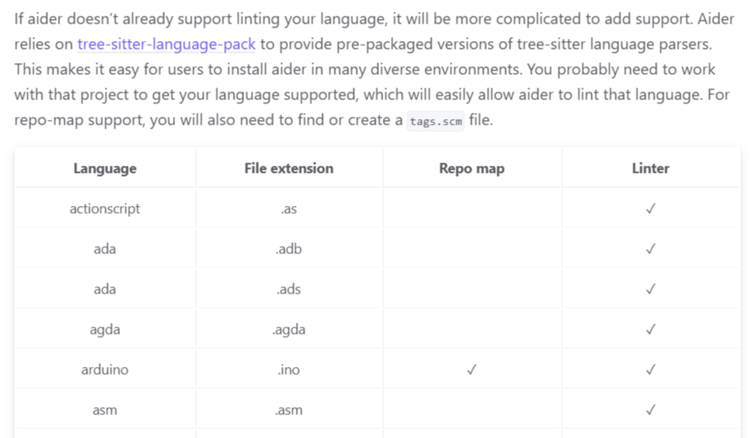
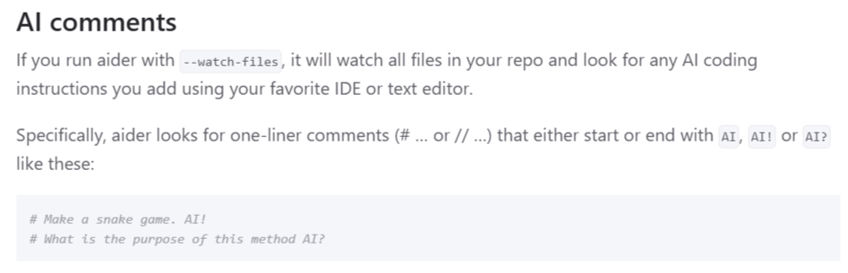
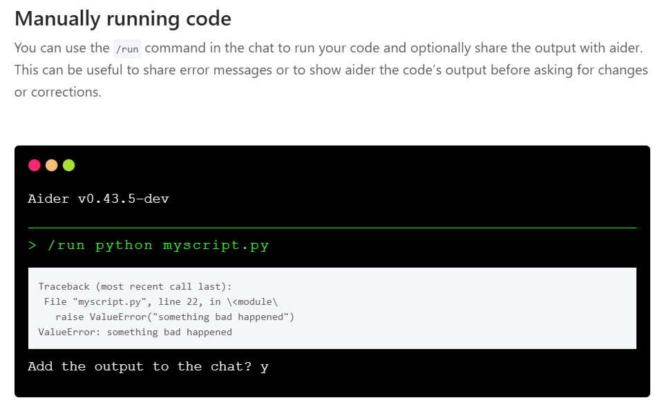

---
presentation:
    theme: night.css
    width: 1920
    height: 1080
    slideNumber: true
    hideAddressBar: true
    history: true
---

<!-- slide -->

## Supercharging Your Daily Workflow   with `Aider` and `Local LLMs`

|||
|---|---|
|  <h4>AI Sharing sessions
 2025-07-09 @ Taipei City, Taiwan</h4>  By [Jazz Yao-Tsung Wang](https://jazzwang.github.io/cv/)  Sr. Director of Engineering, TAO Digital Chairman, Taiwan Data Engineering Association | |

<!-- slide -->

## Agenda

<table><tr>
<td>

- What is Aider?
- What is Ollama?
- Why do we need to use local LLM?
- Install Aider on different platform
  - Google Colab / Cloud Shell
  - Github Codespaces
  - local Windows machine
- Switch between LLM models
  - Local LLM: Ollama
    - Google Gemma 3 1B
  - Public Free LLM
    - Google Gemini 2.5 Flash
- How to request Google Gemini API key?

</td>
<td>

- Known Use Cases that I use Aider:
  - Reverse Engineering
    - create high-level overview
    - create sequence diagram
  - Meeting Summary
    - MS Teams Live Caption (JSON)
    - MS Stream Transcript file (WebVTT)
  - Monthly Team Achievement Summary
    - from Jira JQL export CSV file
  - rewrite program:
    - from Shell Script to Python script
    - migrate from Selenium to Playwright
  - create unit test

</td>
</tr></table>

<!-- slide -->

## What is Aider?

<table><tr>
<td>

- **AI Pair Programming in Your Terminal**: 
  Aider allows you to pair program with Large Language Models (LLMs) directly from your terminal.
- **Works with Existing Codebases**: 
  Ideal for starting new projects or building upon your current code.
- **Supports Various LLMs**: 
  Works best with models like *Claude 3.7 Sonnet*, *DeepSeek R1* & Chat V3, *OpenAI o1, o3-mini & GPT-4o*, and can connect to almost `any LLM`, including `local models`.
- **Codebase Mapping**: 
  Creates a map of your entire codebase to work effectively on larger projects.

</td>
<td>

 

https://aider.chat/

<video autoplay="" loop="" muted="" playsinline="" preload="metadata">
  <source src="https://aider.chat/assets/shell-cmds-small.mp4" type="video/mp4">
  Your browser does not support the video tag.
</video>

<small>Source: <a href='https://aider.chat/assets/shell-cmds-small.mp4' target='_blank'>https://aider.chat/assets/shell-cmds-small.mp4</a></small>

</td>
</tr></table>

<!-- slide vertical=true -->

### Aider Features ( 1 ) - `I tried`

<table><tr>
<td>

<small><a href='https://aider.chat/docs/languages.html'>https://aider.chat/docs/languages.html</a></small>

<small><a href='https://aider.chat/docs/usage/watch.html'>hhttps://aider.chat/docs/usage/watch.html</a></small>

</td>
<td>

- **Extensive Language Support**: 
  Compatible with over 100 programming languages (Python, JavaScript, Rust, Ruby, Go, C++, PHP, HTML, CSS, etc.).
- **Git Integration**: 
  *Automatically commits changes* with sensible messages, allowing easy diffing, management, and undoing of AI changes using standard Git tools.
- **IDE Integration**: 
  Can be used from within your favorite IDE or editor by adding comments to your code.
- **Multimedia Context**: Supports adding images and web pages to the chat for visual context, screenshots, and reference documentation.

</td>
</tr></table>

<!-- slide vertical=true -->

### Aider Features ( 2 ) - `I dit not yet tried`

<table><tr>
<td>

- **Voice-to-Code**: 
  Enables speaking with Aider to request features, test cases, or bug fixes using your voice.
- **Linting & Testing Integration**: 
  *Automatically lints and tests code after changes*, and can fix problems detected by linters and test suites.
- **Web Chat Compatibility**: 
  Can streamline copy/pasting code with LLM web chat interfaces, though it works best with LLM APIs.

</td><td>

<small>

Source: https://aider.chat/docs/usage/lint-test.html

</small>

</td>
</tr></table>

<!-- slide -->

## What is Ollama?

<!-- slide -->

## Why do we need to use local LLM?

<!-- slide -->

## How to install Aider on different platforms?
- Google Colab
- Google Cloud Shell
- Github Codespaces
- Local Windows machine, etc.

# How to switch between local and public LLM models?
(served by Ollama vs. e.g. Google Gemini, free tokens from OpenRouter, etc.)

# How to request Google Gemini API key?

# How to request OpenRouter API key?

# How to configure Aider to use different API keys of public LLM models?

# Known Use Cases for Aider to speed up daily jobs

## Reverse Engineering
Make it easy to understand others' git repositories

## Meeting Summary
### From Microsoft Teams Live Caption (JSON file format)
### From Microsoft Stream (Teams Meeting Recording) Transcript file (WebVTT file format)

## Monthly Team Achievement Summary
### From Jira JQL export CSV file

## Rewrite Program
### From Shell Script to Python script
### Migrate from Selenium to Playwright

## Create Unit Tests

## Agenda

<table><tr>
<td>

- What is Aider?
- What is Ollama?
- Why do we need to use local LLM?
- How to install Aider on different platform
  - Google Colab
  - Google Cloud Shell
  - Github Codespaces
  - local Windows machine
- How to switch between local LLM models and public LLM models
  - Local LLM: Ollama
    - Google Gemma 3 1B
  - Public Free LLM
    - Google Gemini 2.5 Flash
- How to request Google Gemini API key?

</td>
<td>

- Known use cases that I use Aider for speed up my daily jobs, including:
  - Reverse Engineering: make it easy to understand others' git repositories
  - Meeting Summary:
    - from Microsoft Teams Live Caption (JSON file format)
    - from Microsoft Stream (Teams Meeting Recording) Transcript file (WebVTT file format)
  - Monthly Team Achievement Summary:
    - from Jira JQL export CSV file
  - rewrite program:
    - from Shell Script to Python script
    - migrate from Selenium to Playwright
  - create unit test

</td>
</tr></table>